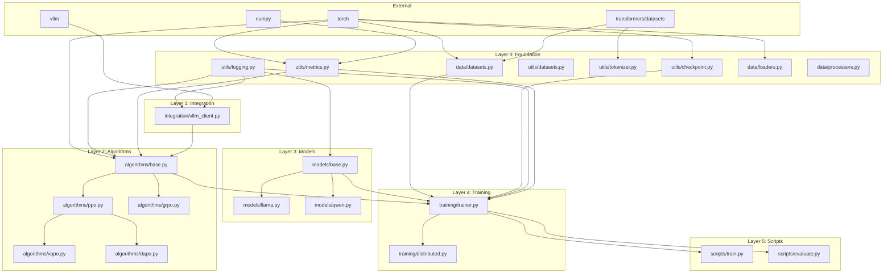

# ThinkRL Dependency Map

Complete dependency map showing which files depend on which, including both internal project dependencies and external packages.

---

## Quick Reference

```
                         ┌──────────────────────────────────────┐
                         │          External Packages           │
                         │  torch, numpy, transformers, vllm    │
                         └─────────────────┬────────────────────┘
                                           │
    ┌──────────────────────────────────────┼──────────────────────────────────────┐
    │                                      │                                      │
    ▼                                      ▼                                      ▼
┌─────────────────┐               ┌─────────────────┐               ┌─────────────────┐
│   utils/*.py    │               │   data/*.py     │               │ integration/*.py │
│   (Foundation)  │               │   (Foundation)  │               │   (Foundation)   │
└────────┬────────┘               └────────┬────────┘               └────────┬────────┘
         │                                 │                                  │
         └─────────────────┬───────────────┴──────────────────────────────────┘
                           │
                           ▼
                  ┌─────────────────┐
                  │ algorithms/*.py │
                  │   (Core RL)     │
                  └────────┬────────┘
                           │
         ┌─────────────────┼─────────────────┐
         │                 │                 │
         ▼                 ▼                 ▼
┌─────────────────┐ ┌─────────────────┐ ┌─────────────────┐
│  models/*.py    │ │  peft/*.py      │ │ reasoning/*.py  │
└────────┬────────┘ └────────┬────────┘ └────────┬────────┘
         │                   │                   │
         └─────────────────┬─┴───────────────────┘
                           │
                           ▼
                  ┌─────────────────┐
                  │ training/*.py   │
                  │   (Trainers)    │
                  └────────┬────────┘
                           │
                           ▼
                  ┌─────────────────┐
                  │ evaluation/*.py │
                  │  (Eval & Bench) │
                  └────────┬────────┘
                           │
                           ▼
                  ┌─────────────────┐
                  │  scripts/*.py   │
                  │     (CLI)       │
                  └─────────────────┘
```

---

## Layer 0: Foundation (No Internal Dependencies)

These files depend only on external packages and Python standard library.

### thinkrl/utils/logging.py
```
External Dependencies:
├── logging (stdlib)
├── pathlib (stdlib)
├── datetime (stdlib)
├── sys (stdlib)
├── os (stdlib)
├── typing (stdlib)
├── warnings (stdlib)
└── colorama (optional)

Internal Dependencies: None
```

### thinkrl/utils/metrics.py
```
External Dependencies:
├── torch
├── numpy
├── logging (stdlib)
├── collections (stdlib)
├── typing (stdlib)
├── scipy (optional)
├── cupy (optional, GPU acceleration)
└── cupyx (optional, GPU acceleration)

Internal Dependencies: None
```

### thinkrl/utils/checkpoint.py
```
External Dependencies:
├── torch
├── pathlib (stdlib)
├── json (stdlib)
├── logging (stdlib)
├── datetime (stdlib)
├── shutil (stdlib)
├── typing (stdlib)
├── warnings (stdlib)
├── yaml (optional)
└── safetensors (optional)

Internal Dependencies: None
```

### thinkrl/utils/datasets.py
```
External Dependencies:
├── torch
└── typing (stdlib)

Internal Dependencies: None
```

### thinkrl/utils/tokenizer.py
```
External Dependencies:
├── torch
├── pathlib (stdlib)
├── logging (stdlib)
├── typing (stdlib)
├── warnings (stdlib)
└── transformers (optional)

Internal Dependencies: None
```

### thinkrl/data/datasets.py
```
External Dependencies:
├── torch
├── datasets (HuggingFace, optional)
├── collections (stdlib)
├── typing (stdlib)
└── logging (stdlib)

Internal Dependencies: None
```

### thinkrl/data/loaders.py
```
External Dependencies:
├── torch
└── typing (stdlib)

Internal Dependencies: None
```

### thinkrl/data/processors.py
```
External Dependencies:
├── PIL/Pillow (optional)
├── librosa (optional)
├── typing (stdlib)
└── logging (stdlib)

Internal Dependencies: None
```

---

## Layer 1: Integration

### thinkrl/integration/vllm_client.py
```
External Dependencies:
├── torch
├── requests
├── vllm (optional)
└── typing (stdlib)

Internal Dependencies:
└── thinkrl.utils.logging
```

---

## Layer 2: Package Exports

### thinkrl/utils/__init__.py
```
Internal Dependencies:
├── thinkrl.utils.checkpoint
├── thinkrl.utils.datasets
├── thinkrl.utils.logging
├── thinkrl.utils.metrics
└── thinkrl.utils.tokenizer
```

### thinkrl/__init__.py
```
Internal Dependencies:
├── thinkrl.data.datasets
├── thinkrl.data.loaders
├── thinkrl.utils.checkpoint
├── thinkrl.utils.logging
└── thinkrl.utils.metrics
```

---

## Layer 3: Core Algorithms

### thinkrl/algorithms/base.py
```
External Dependencies:
├── torch
├── torch.nn
├── torch.distributed
├── typing (stdlib)
└── abc (stdlib)

Internal Dependencies:
├── thinkrl.utils.logging
├── thinkrl.utils.metrics
└── thinkrl.integration.vllm_client (optional)
```

### thinkrl/algorithms/ppo.py (TODO)
```
Expected Internal Dependencies:
└── thinkrl.algorithms.base
```

### thinkrl/algorithms/vapo.py (TODO)
```
Expected Internal Dependencies:
├── thinkrl.algorithms.base
└── thinkrl.algorithms.ppo
```

### thinkrl/algorithms/dapo.py (TODO)
```
Expected Internal Dependencies:
├── thinkrl.algorithms.base
└── thinkrl.algorithms.ppo
```

### thinkrl/algorithms/grpo.py (TODO)
```
Expected Internal Dependencies:
└── thinkrl.algorithms.base
```

### thinkrl/algorithms/reinforce.py (TODO)
```
Expected Internal Dependencies:
└── thinkrl.algorithms.base
```

### thinkrl/algorithms/dpo.py (TODO)
```
Expected Internal Dependencies:
└── thinkrl.algorithms.base
```

---

## Layer 4: Models

### thinkrl/models/base.py (TODO)
```
Expected Internal Dependencies:
└── thinkrl.utils.logging
```

### thinkrl/models/critics.py (TODO)
```
Expected Internal Dependencies:
└── thinkrl.models.base
```

### thinkrl/models/gpt.py (TODO)
```
Expected Internal Dependencies:
└── thinkrl.models.base
```

### thinkrl/models/llama.py (TODO)
```
Expected Internal Dependencies:
└── thinkrl.models.base
```

### thinkrl/models/qwen.py (TODO)
```
Expected Internal Dependencies:
└── thinkrl.models.base
```

### thinkrl/models/t5.py (TODO)
```
Expected Internal Dependencies:
├── thinkrl.models.base
└── thinkrl.models.encoder_decoder
```

### thinkrl/models/encoder_decoder.py (TODO)
```
Expected Internal Dependencies:
└── thinkrl.models.base
```

### thinkrl/models/moe.py (TODO)
```
Expected Internal Dependencies:
└── thinkrl.models.base
```

### thinkrl/models/multimodal.py (TODO)
```
Expected Internal Dependencies:
├── thinkrl.models.base
└── thinkrl.data.processors
```

---

## Layer 5: PEFT

### thinkrl/peft/config.py (TODO)
```
Expected Internal Dependencies: None
```

### thinkrl/peft/peft_model.py (TODO)
```
Expected Internal Dependencies:
├── thinkrl.models.base
└── thinkrl.peft.config
```

### thinkrl/peft/optimizer.py (TODO)
```
Expected Internal Dependencies:
└── thinkrl.peft.peft_model
```

---

## Layer 6: Reasoning

### thinkrl/reasoning/config.py (TODO)
```
Expected Internal Dependencies: None
```

### thinkrl/reasoning/cot/prompts.py (TODO)
```
Expected Internal Dependencies: None
```

### thinkrl/reasoning/cot/cot.py (TODO)
```
Expected Internal Dependencies:
├── thinkrl.reasoning.config
├── thinkrl.reasoning.cot.prompts
└── thinkrl.models.*
```

### thinkrl/reasoning/tot/tree.py (TODO)
```
Expected Internal Dependencies: None
```

### thinkrl/reasoning/tot/evaluator.py (TODO)
```
Expected Internal Dependencies:
├── thinkrl.reasoning.tot.tree
└── thinkrl.models.*
```

### thinkrl/reasoning/tot/tot.py (TODO)
```
Expected Internal Dependencies:
├── thinkrl.reasoning.config
├── thinkrl.reasoning.tot.tree
└── thinkrl.reasoning.tot.evaluator
```

---

## Layer 7: Training

### thinkrl/training/trainer.py (TODO)
```
Expected Internal Dependencies:
├── thinkrl.algorithms.*
├── thinkrl.models.*
├── thinkrl.data.*
├── thinkrl.utils.checkpoint
├── thinkrl.utils.logging
└── thinkrl.utils.metrics
```

### thinkrl/training/distributed.py (TODO)
```
Expected Internal Dependencies:
├── thinkrl.training.trainer
└── thinkrl.utils.logging
```

### thinkrl/training/cot_trainer.py (TODO)
```
Expected Internal Dependencies:
├── thinkrl.training.trainer
└── thinkrl.reasoning.cot
```

### thinkrl/training/tot_trainer.py (TODO)
```
Expected Internal Dependencies:
├── thinkrl.training.trainer
└── thinkrl.reasoning.tot
```

### thinkrl/training/multimodal_trainer.py (TODO)
```
Expected Internal Dependencies:
├── thinkrl.training.trainer
└── thinkrl.models.multimodal
```

---

## Layer 8: Evaluation

### thinkrl/evaluation/metrics.py (TODO)
```
Expected Internal Dependencies:
└── thinkrl.utils.metrics
```

### thinkrl/evaluation/evaluators.py (TODO)
```
Expected Internal Dependencies:
├── thinkrl.evaluation.metrics
└── thinkrl.models.*
```

### thinkrl/evaluation/benchmarks.py (TODO)
```
Expected Internal Dependencies:
└── thinkrl.evaluation.evaluators
```

---

## Layer 9: Generation

### thinkrl/generation/vllm_engine.py (TODO)
```
Expected Internal Dependencies:
├── thinkrl.integration.vllm_client
└── thinkrl.utils.logging
```

---

## Layer 10: Registry

### thinkrl/registry/algorithms.py (TODO)
```
Expected Internal Dependencies:
└── thinkrl.algorithms.*
```

### thinkrl/registry/models.py (TODO)
```
Expected Internal Dependencies:
└── thinkrl.models.*
```

---

## Layer 11: CLI Scripts

### thinkrl/scripts/train.py (TODO)
```
Expected Internal Dependencies:
├── thinkrl.training.trainer
├── thinkrl.algorithms.*
├── thinkrl.models.*
├── thinkrl.data.*
└── thinkrl.utils.*
```

### thinkrl/scripts/evaluate.py (TODO)
```
Expected Internal Dependencies:
├── thinkrl.evaluation.*
├── thinkrl.models.*
└── thinkrl.utils.*
```

### thinkrl/scripts/chain_of_thought.py (TODO)
```
Expected Internal Dependencies:
├── thinkrl.training.cot_trainer
└── thinkrl.reasoning.cot
```

### thinkrl/scripts/tree_of_thought.py (TODO)
```
Expected Internal Dependencies:
├── thinkrl.training.tot_trainer
└── thinkrl.reasoning.tot
```

### thinkrl/scripts/multimodal_train.py (TODO)
```
Expected Internal Dependencies:
└── thinkrl.training.multimodal_trainer
```

### thinkrl/scripts/generate_rlaif_data.py (TODO)
```
Expected Internal Dependencies:
├── thinkrl.data.*
└── thinkrl.models.*
```

---

## Test File Dependencies

### tests/test_utils/test_checkpoint.py
```
Internal Dependencies:
└── thinkrl.utils.checkpoint
```

### tests/test_utils/test_logging.py
```
Internal Dependencies:
└── thinkrl.utils.logging
```

### tests/test_utils/test_metrics.py
```
Internal Dependencies:
└── thinkrl.utils.metrics
```

### tests/test_utils/test_metrics_mock.py
```
Internal Dependencies:
└── thinkrl.utils
```

### tests/test_utils/test_tokenizer.py
```
Internal Dependencies:
└── thinkrl.utils.tokenizer
```

### tests/test_utils/test_data.py
```
Internal Dependencies:
└── thinkrl.utils.datasets
```

### tests/test_data/test_datasets.py
```
Internal Dependencies:
└── thinkrl.data.datasets
```

### tests/test_data/test_loaders.py
```
Internal Dependencies:
└── thinkrl.data.loaders
```

### tests/test_data/test_processors.py
```
Internal Dependencies:
└── thinkrl.data.processors
```

---

## External Package Summary

### Required (Core)
| Package | Files Using | Purpose |
|---------|-------------|---------|
| torch | 11 | Deep learning framework |
| numpy | 4 | Numerical computing |

### Optional (Extensions)
| Package | Files Using | Purpose |
|---------|-------------|---------|
| transformers | 2 | HuggingFace models |
| datasets | 1 | HuggingFace datasets |
| vllm | 1 | High-throughput inference |
| safetensors | 1 | Safe model serialization |
| pyyaml | 1 | YAML config parsing |
| scipy | 1 | Scientific computing |
| cupy/cupyx | 1 | GPU-accelerated arrays |
| PIL/Pillow | 1 | Image processing |
| librosa | 1 | Audio processing |
| colorama | 1 | Colored terminal output |
| requests | 1 | HTTP requests |

### Python Standard Library
| Module | Files Using |
|--------|-------------|
| typing | 12 |
| logging | 8 |
| pathlib | 4 |
| collections | 3 |
| datetime | 2 |
| json | 1 |
| shutil | 1 |
| sys | 1 |
| os | 1 |
| abc | 1 |
| warnings | 3 |

---

## Dependency Graph (Mermaid)



---

## Reverse Dependencies (What Depends on Each File)

### thinkrl/utils/logging.py
Used by:
- thinkrl/integration/vllm_client.py
- thinkrl/algorithms/base.py
- thinkrl/__init__.py

### thinkrl/utils/metrics.py
Used by:
- thinkrl/algorithms/base.py
- thinkrl/__init__.py

### thinkrl/utils/checkpoint.py
Used by:
- thinkrl/__init__.py

### thinkrl/integration/vllm_client.py
Used by:
- thinkrl/algorithms/base.py

### thinkrl/data/datasets.py
Used by:
- thinkrl/__init__.py

### thinkrl/data/loaders.py
Used by:
- thinkrl/__init__.py

### thinkrl/algorithms/base.py
Used by:
- thinkrl/algorithms/ppo.py (planned)
- thinkrl/algorithms/vapo.py (planned)
- thinkrl/algorithms/dapo.py (planned)
- thinkrl/algorithms/grpo.py (planned)
- thinkrl/algorithms/reinforce.py (planned)
- thinkrl/algorithms/dpo.py (planned)

---

## Summary Statistics

| Metric | Value |
|--------|-------|
| Total Python files | 103 |
| Files with dependencies documented | 22 |
| External packages (required) | 2 |
| External packages (optional) | 11 |
| Standard library modules | 13 |
| Maximum dependency depth | 11 layers |
| Files in Layer 0 (foundation) | 8 |
| Files using torch | 11 |
